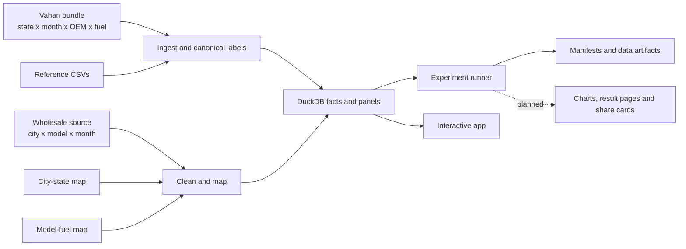

# Data Truth: Complexity Lab

Last verified: **2026-06-13**

This is the governing data contract for the lab. It records what each file actually
contains, what was verified from the files, what can be joined, and what must not be
claimed. When this document conflicts with a chart title, notebook, or older comment,
this document wins until the underlying data is corrected and re-verified.

## 1. Truth Labels

Every output should carry one of these labels:

| Label | Meaning |
|---|---|
| **Observed** | A value directly aggregated from Vahan registrations or wholesale dispatch rows. |
| **Mapped** | An observed value assigned through a maintained mapping, such as city to state or model to primary fuel. |
| **Derived** | Arithmetic from observed/mapped data: share, growth, HHI, ratio, per-capita value. |
| **Estimated** | Statistical inference: regression, changepoint, regime, diffusion parameter, nowcast, forecast. |
| **Simulated** | A scenario generated under explicit assumptions; not a forecast. |

Reference-data quality is separate:

`official > official_derived > derived > reported > approximate > proxy > estimate > placeholder`

Quality is not a numeric score. It says how strongly the value is tied to the named
source and how much transformation or judgment entered before it reached the lab.

## 2. Verified Data Flow



Transformation code:

- Vahan ingest: [`src/complexity_lab/data/ingest.py`](src/complexity_lab/data/ingest.py)
- State panels: [`src/complexity_lab/data/panel.py`](src/complexity_lab/data/panel.py)
- Wholesale cleaning and views: [`src/complexity_lab/data/wholesale.py`](src/complexity_lab/data/wholesale.py)
- Reference loader: [`src/complexity_lab/data/reference.py`](src/complexity_lab/data/reference.py)
- Numeric validation: [`scripts/validate_numbers.py`](scripts/validate_numbers.py)
- Data refresh process: [`docs/refresh-runbook.md`](docs/refresh-runbook.md)

## 3. Primary Data Truth

### 3.1 Vahan registrations

Local source: [`data/raw/vahan_master.json.gz`](data/raw/vahan_master.json.gz)

Official public anchor: [MoRTH/NIC Vahan Analytics](https://analytics.parivahan.gov.in/analytics/).
The portal states that its statistics cover RTOs running on Vahan 4.0. The local
bundle is supplied by Vahan Intelligence and is not a direct export preserved with
a public query URL, so exact row-level reproduction against the live public portal
is not currently possible.

Verified contents:

| Property | Verified value |
|---|---:|
| Encoded fact rows | 205,779 |
| Period | January 2012 to April 2026 |
| Complete calendar years | 2012-2025 |
| 2026 months present | 4 |
| Regions in bundle | 36 including All India |
| State/UT series excluding All India | 35 |
| OEM labels | 28 |
| Fuel labels | CNG, Petrol, EV, Diesel, Strong Hybrid |
| Embedded events | 47 |
| Bundle `last_updated` | 2026-05-01 |
| SHA-256 prefix | `70c56d9641fdabed` |

#### Vahan truth rules

1. **All India is a separate observed series.** Never reconstruct it by summing
   states. The state sum differs from All India by between roughly 0% and 2.3%,
   depending on year.
2. **2026 is partial despite the bundle metadata.** The bundle says
   `partial_cal_years = []`, but only January-April 2026 are present. Completeness
   must be calculated from observed months, not trusted from this flag.
3. **Telangana is absent from the current Vahan bundle.** The 35 subnational series
   include Andhra Pradesh but not Telangana. Treat the AP series as the bundle's
   continuous AP geography across the 2014 bifurcation. Do not join Telangana
   wholesale/reference rows to Vahan AP and call the result state-comparable.
4. **Lakshadweep is sparse.** It is missing 52 state-months; Ladakh is missing May
   2020. Missing rows are not automatically zero registrations.
5. **Fuel categories are source classifications, not a powertrain census.** Strong
   Hybrid has 1 national registration in 2018, 2 in 2022, 5 in 2023, then 57,299
   in 2024. The 2024 jump is a classification/reporting break. Do not fit a
   continuous hybrid adoption curve across it.
6. **The bundle is described as 4W passenger vehicles, but the OEM vocabulary
   contains small-volume labels such as Bajaj Auto, Hero, TVS, Piaggio, Eicher, and
   Ashok Leyland.** Their combined national volume is tiny, but they should be
   retained as source classifications or explicitly grouped, never silently
   relabeled.
7. **Recent Vahan months can continue filling after first publication.** Forecast
   training cutoffs and current-month comparisons need a completeness/vintage rule,
   not a permanent "drop two months" assumption.

### 3.2 Wholesale dispatches

Local snapshots:

- Original-shape parquet: [`data/raw/wholesale_raw.parquet`](data/raw/wholesale_raw.parquet)
- Cleaned analytical parquet: [`data/raw/wholesale_clean.parquet`](data/raw/wholesale_clean.parquet)

These files are local proprietary data and are gitignored. The original XLSB is
outside the repository. There is no public source URL against which row-level
commercial dispatch values can be independently verified.

> **Non-negotiable truth: wholesale has no fuel cut.** The source contains no
> fuel/powertrain field and does not split a model's quantity into Petrol, Diesel,
> CNG, EV, or Hybrid. Wholesale can be analysed by city, mapped state, OEM, channel,
> model, and segment only. Any fuel-related label added later is external model
> metadata, not an observed wholesale quantity by fuel.

Verified contents:

| Property | Raw snapshot | Clean snapshot |
|---|---:|---:|
| Rows | 727,580 | 727,040 |
| Period | April 2017-April 2026 | April 2017-April 2026 |
| Total quantity | 18,631,389 | 18,631,389 |
| Columns | 11 | 19 |
| SHA-256 prefix | `0464b223281913b2` | `655dee76f6b67556` |

Cleaning facts:

- 540 raw rows have non-numeric/null quantity and are removed; they contribute zero
  parsed volume, so total quantity is unchanged.
- The raw snapshot has 66 excess exact duplicate rows carrying 193 units.
- The cleaned projection has 934 excess exact duplicate rows carrying 5,170 units.
  Some arise because source columns such as `city group` are intentionally dropped,
  making formerly distinct rows look identical. They are source records and are
  currently summed, not deduplicated. This should be investigated before claiming
  row-level uniqueness.
- Maruti ARENA and NEXA are merged to `maker = Maruti Suzuki`, while channel is
  retained.
- OEMs are additionally mapped to Vahan labels through `maker_vahan`.

#### Wholesale coverage regimes

| Regime | Period | Units | Valid use |
|---|---|---:|---|
| `sample` | 2017-04 to 2022-03 | 1,021,936 | Longitudinal analysis only on a stable panel of repeatedly observed cities. |
| `full` | 2022-04 to 2026-04 | 17,609,453 | National totals and mapped state/OEM/model/segment analysis. |

Never use `year >= 2022` as a substitute for full coverage because January-March
2022 are sample rows. Use `coverage = 'full'` or `date >= '2022-04-01'`.

#### City-to-state mapping

Mapping file: [`data/reference/city_state.csv`](data/reference/city_state.csv)

Verified:

- 282 unique city labels map to 32 states/UTs.
- Wholesale contains 748 distinct city labels.
- Mapped cities account for **96.33% of total volume**.
- Full-era mapped-volume coverage declines from 97.03% in 2022 to 94.63% in
  January-April 2026, so the mapping still needs continuous maintenance.
- Largest intentional/unresolved buckets include `OTHERS` and `NCR`; large mappable
  gaps include Berhampur, Neemuch, Kalyan, Saharanpur, Jagdalpur, Tuticorin,
  Sangamner, Udhampur, Sangrur, Hassan, and others.

Mapping policy:

1. Source city labels are normalized to uppercase and trimmed.
2. Each geographic city gets one canonical `state_code`.
3. Ambiguous labels require a note in the mapping file.
4. Non-geographic buckets remain unmapped.
5. Each refresh must report mapped row share, mapped volume share, new city labels,
   and the largest unmapped labels.
6. State charts must display mapped-volume coverage.

#### Telangana/AP join rule

Wholesale includes both AP and TS:

| State | Full-era wholesale units |
|---|---:|
| AP | 327,555 |
| TS | 734,032 |

Vahan has AP only and no TS. Therefore:

- Wholesale-only AP and TS analysis is valid as mapped dispatch geography.
- Direct state-level wholesale-to-Vahan comparison is **not valid for AP or TS**.
- National joins remain valid because both wholesale states roll into the national
  wholesale total and Vahan supplies its own All India total.
- A future reconciliation must obtain a Telangana Vahan series or define a clearly
  labeled combined `AP+TS` comparison with compatible covariates.

#### Model metadata is not a wholesale fuel cut

Mapping file: [`data/reference/model_fuel_map.csv`](data/reference/model_fuel_map.csv)

Verified:

- 120 mapped nameplates out of 197 observed wholesale model labels.
- 99.78% of total wholesale volume belongs to a model with externally assigned
  fuel metadata; full-era annual model-metadata coverage is at least 99.82%.
- `primary_fuel` is an approximate dominant-fuel allocation for mixed nameplates.
- `ev_only = 1` is exact for EV-only nameplates, but materially undercounts EV
  dispatches because Nexon, Punch, Tiago, Creta and other mixed nameplates cannot be
  split by fuel.

This mapping does **not** create a fuel cut. It cannot tell how many Nexon units
were Petrol, Diesel, or EV, for example. If retained for exploratory work, use
three visible model-metadata categories:

- **Exact EV-only**
- **Mixed-fuel nameplate, EV component unknown**
- **Unclassified**

Do not aggregate `primary_fuel` and call it wholesale fuel mix, fuel share, fuel
volume, or a fuel cut. The `ws_fuel_month` database view is a legacy nameplate
proxy and should be renamed or removed from user-facing analysis.

## 4. Geographic and Join Truth

Canonical dimension: [`data/reference/states.csv`](data/reference/states.csv)

The dimension has 37 rows: All India plus 36 states/UTs. It is intentionally a
superset used across Vahan, wholesale, maps, and references.

| Set | Codes excluding All India |
|---|---:|
| Canonical dimension | 36 |
| Vahan | 35 |
| Wholesale mapped | 32 |
| Dimension but not Vahan | TS |
| Wholesale but not Vahan | TS |
| Vahan but not wholesale mapping | AN, DN, LA, LD |

Map assets:

- Geometry: [`data/raw/india_states.geojson`](data/raw/india_states.geojson)
- State name bridge: [`data/reference/states.csv`](data/reference/states.csv)
- Land borders: [`data/reference/state_adjacency.csv`](data/reference/state_adjacency.csv)

Verified:

- All 36 non-national `geojson_name` values match a GeoJSON feature.
- No GeoJSON feature is orphaned.
- The adjacency file has 68 undirected edges, no self-edges, no reverse duplicates,
  and no unknown state codes.
- Adjacency is hand-compiled and represents land borders, not travel, trade,
  dealership, or media connectivity.

## 5. Reference Data Truth

### 5.1 Income and real GSDP

Files:

- [`data/reference/state_income.csv`](data/reference/state_income.csv): current-price
  per-capita NSDP.
- [`data/reference/state_income_constant.csv`](data/reference/state_income_constant.csv):
  constant-2011-12-price per-capita NSDP.
- [`data/reference/state_gsdp.csv`](data/reference/state_gsdp.csv):
  constant-2011-12-price GSDP and derived real growth.

Source: [RBI Handbook of Statistics on Indian States 2024-25](https://www.rbi.org.in/Scripts/AnnualPublications.aspx?head=Handbook%20of%20Statistics%20on%20Indian%20States),
Tables 19, 20, and 22.

- Each file has 453 rows, 33 state/UT codes, FY2011-12 to FY2024-25.
- Level values are official. `gsdp_real_growth_pct` is derived from adjacent official
  constant-price levels.
- Missing from the file: DN, LA, LD.
- The annual panel joins fiscal year starting in the calendar year. This is an
  approximation when used against calendar-year registrations.
- Current-price NSDP mixes real growth and inflation. Use constant-price data for
  real-income questions.
- Latest fiscal years are missing for some states. Growth is null when either
  adjacent level is unavailable.
- Pre-reorganisation Jammu & Kashmir includes Ladakh. AP/TS source-history caveats
  remain and must not be hidden by a clean state code.

### 5.2 Population and urban/rural structure

Files:

- [`data/reference/population.csv`](data/reference/population.csv): 2011 and rounded
  2024 anchors.
- [`data/reference/state_population_annual.csv`](data/reference/state_population_annual.csv):
  annual estimated denominator.
- [`data/reference/urbanization.csv`](data/reference/urbanization.csv): Census-2011
  urban/rural shares.

Official anchor: [Census of India tables](https://censusindia.gov.in/census.website/data/census-tables).

- `population.csv` and `urbanization.csv` each have 37 geographies including ALL.
- `state_population_annual.csv` has 555 rows: 37 geographies x 2012-2026.
- Annual totals use geometric interpolation between 2011 and 2024 anchors, then the
  same implied growth rate for 2025-2026 extrapolation.
- Urban and rural counts apply fixed Census-2011 shares in every year. They are not
  observed annual urbanization estimates.
- `regs_per_1000_population` and the compatibility alias
  `regs_per_1000_capita` use the annual estimated denominator.
- `regs_per_1000_population_2024` is retained as an explicitly fixed-2024
  sensitivity metric.
- All annual population values are quality `estimate`, even where their anchors
  originated in official tables.

### 5.3 CNG stations

File: [`data/reference/cng_stations.csv`](data/reference/cng_stations.csv)

Official anchor: [PNGRB](https://pngrb.gov.in/eng-web/)

- 38 rows: national 2024 and 2025 totals plus 36 state/UT rows for 2024.
- The 2024 snapshot is dated 31 May 2024. State rows sum exactly to the official
  national total of 6,890.
- The 2025 snapshot is national only: 8,067 as of March 2025.
- Gas areas spanning states are allocated to a primary state, so state values are
  approximate even when the national source is official.
- `coverage_scope`, `snapshot_date`, allocation coverage, and reconciliation notes
  are stored in the file and carried into the annual panel.
- No 2012-2023 state history and no 2025 state split are available. No interpolation
  is permitted.

### 5.4 Public EV charging

File: [`data/reference/ev_charging.csv`](data/reference/ev_charging.csv)

Official anchor: [Ministry of Power](https://www.powermin.gov.in/)

- 40 rows.
- 2024 contains the national total plus only Maharashtra and Delhi state anchors.
- 2025 contains a national total of 29,277 and 36 stored state/UT rows. Those state
  rows sum to 22,733, only **77.65%** of the national total.
- Many 2025 state values are approximate. The table is therefore an incomplete
  allocation, not a complete state census despite containing every state code.
- `coverage_scope`, `snapshot_date`, allocation coverage, and reconciliation notes
  are stored in the file and carried into the annual panel.
- No 2012-2023 historical panel is available. Do not use these snapshots as a
  continuously measured annual treatment.

### 5.5 Fuel prices

File: [`data/reference/fuel_prices.csv`](data/reference/fuel_prices.csv)

Local source snapshots:

- [`data/raw/ppac/bb_petrol_2019.html`](data/raw/ppac/bb_petrol_2019.html)
- [`data/raw/ppac/bb_petrol_2021.html`](data/raw/ppac/bb_petrol_2021.html)
- [`data/raw/ppac/bb_diesel_2019.html`](data/raw/ppac/bb_diesel_2019.html)
- [`data/raw/ppac/bb_diesel_2021.html`](data/raw/ppac/bb_diesel_2021.html)
- [`data/raw/ppac/gr_cng_2019.html`](data/raw/ppac/gr_cng_2019.html)
- [`data/raw/ppac/gr_cng_2021.html`](data/raw/ppac/gr_cng_2021.html)
- [`data/raw/ppac/gr_cng_2024.html`](data/raw/ppac/gr_cng_2024.html)

Compiler: [`scripts/compile_state_fuel_prices.py`](scripts/compile_state_fuel_prices.py)

Official anchor: [PPAC petroleum prices](https://ppac.gov.in/content/245_1_PricesPetroleum.aspx)

- 701 rows, 2012-2026, quality approximate or proxy.
- Delhi is the directly compiled bellwether; `ALL` mirrors Delhi.
- Other state series apply snapshot differentials to the Delhi path.
- Pre-2017 missing state values fall back to the All India/Delhi proxy in the panel.
- CNG coverage is limited to selected city-gas states.
- 2026 values are partial.
- Useful for broad trend/shock analysis; not precise pump-price accounting.

### 5.6 Vehicle lifetime tax

Files:

- [`data/reference/road_tax.csv`](data/reference/road_tax.csv): source
  cross-section.
- [`data/reference/vehicle_lifetime_tax.csv`](data/reference/vehicle_lifetime_tax.csv):
  normalized state x fuel comparison.

- 25 states/UTs, as-of 2024; 125 normalized rows across Petrol, Diesel, CNG,
  Strong Hybrid, and EV.
- Missing: AN, AR, DN, LA, LD, ML, MN, MZ, NL, SK, TR.
- The benchmark uses a roughly INR 10 lakh vehicle price.
- For non-EV fuels, the same ICE rate is repeated unless the source distinguished
  fuel. This gives the table a fuel-shaped schema, not five independently observed
  tax schedules.
- One approximate ICE rate and one EV rate cannot represent price slabs, cess,
  vehicle type, registration fees, or changing policy.
- Use as an ordinal cross-sectional policy covariate, never as an invoice calculator.
- No historical 2012-2023 state tax panel was found.

### 5.7 Policy events

Files:

- Curated reference events: [`data/reference/policy_events.csv`](data/reference/policy_events.csv)
- Embedded bundle events: inside [`data/raw/vahan_master.json.gz`](data/raw/vahan_master.json.gz)
- Unified file: [`data/reference/policy_events_canonical.csv`](data/reference/policy_events_canonical.csv)

- The curated file has 27 events; the bundle has 47.
- The canonical file has all 74 records with origin, tier, geographic scope, source
  text, date range, and `possible_overlap`.
- Related records are preserved rather than silently deduplicated.
- Current app event overlays prefer the canonical table.
- Event markers provide context, not causal identification.
- Source text in the bundle is sometimes a citation label rather than a direct URL.

### 5.8 Credit depth, vehicle finance, and dealers

Files:

- [`data/reference/state_personal_loans.csv`](data/reference/state_personal_loans.csv)
- [`data/reference/state_credit_depth.csv`](data/reference/state_credit_depth.csv)
- [`data/reference/financing.csv`](data/reference/financing.csv)
- [`data/reference/dealer_counts.csv`](data/reference/dealer_counts.csv)

- Official RBI personal-loan stock has 787 rows across 37 geographies, 2004-2025.
- Derived credit depth has 507 rows for 2012-2025, joining the official loan stock
  to the estimated annual population denominator.
- Personal loans include broad scheduled-commercial-bank household credit. They are
  not vehicle loans, finance approval rates, NBFC credit, captive OEM finance, or
  finance penetration.
- `financing.csv` retains five national industry estimates only for narrative
  context and remains status `unavailable` for modelling.
- `dealer_counts.csv` now has a documented zero-row schema. The previous national
  placeholder was removed because it could be mistaken for analytical data.
- A usable dealer panel requires dated, deduplicated state x OEM outlet records
  with outlet identity and opening/closure treatment.

### 5.9 Road length

File: [`data/reference/state_road_length.csv`](data/reference/state_road_length.csv)

- 567 rows, 36 geographies including ALL, 2005-2020.
- Official RBI/MoRTH levels with derived rows for current geography handling.
- Large jumps can reflect reporting or boundary changes, not construction.
- There are no observations after March 2020 and no Ladakh row.

### 5.10 Availability catalog and reproducibility

File: [`data/reference/reference_catalog.csv`](data/reference/reference_catalog.csv)

The 22-row catalog is the machine-readable contract for every reference file. It
classifies each dataset as `usable`, `constrained`, or `unavailable`, records
approved use and missing capability, and controls whether the app should show,
warn, or hide it. Ingest validates that every reference CSV is declared exactly
once. The readable guide is [`docs/reference-data.md`](docs/reference-data.md).

Official source workbooks:

- [`data/raw/rbi/table20_pc_nsdp_constant_2024-25.xlsx`](data/raw/rbi/table20_pc_nsdp_constant_2024-25.xlsx)
- [`data/raw/rbi/table22_gsdp_constant_2024-25.xlsx`](data/raw/rbi/table22_gsdp_constant_2024-25.xlsx)
- [`data/raw/rbi/table146_state_road_length_2024-25.xlsx`](data/raw/rbi/table146_state_road_length_2024-25.xlsx)
- [`data/raw/rbi/table159_state_personal_loans_2024-25.xlsx`](data/raw/rbi/table159_state_personal_loans_2024-25.xlsx)

These files were downloaded from the RBI Handbook of Statistics on Indian States
2024-25 and their sheets, headers, units, periods, and source notes were inspected.
Their generated CSVs are declared in `reference_catalog.csv`.

- Table 20: per-capita NSDP at constant 2011-12 prices, FY2011-12 to FY2024-25.
- Table 22: GSDP at constant 2011-12 prices, FY2011-12 to FY2024-25.
- Table 146: road length at end-March, 2005-2020; source is MoRTH.
- Table 159: personal loans outstanding at scheduled commercial banks, 2004-2025.
Full source links, boundary rules, converters, and the acquisition order are in
[`docs/reference-source-roadmap.md`](docs/reference-source-roadmap.md).

## 6. Derived Database Truth

Generated database: [`data/lab.duckdb`](data/lab.duckdb)

This is a rebuildable artifact, not an independent source. Its main tables are
documented in [`docs/data-dictionary.md`](docs/data-dictionary.md).

Verified row counts:

| Table/view | Rows | Truth note |
|---|---:|---|
| `registrations` | 205,779 | Decoded Vahan facts. |
| `panel_state_month` | 6,139 | Sparse state-month panel; absent months are not necessarily zero. |
| `panel_state_year` | 540 | Annual aggregates plus joins. |
| `maker_state_share` | 10,701 | Derived shares and rank changes. |
| `oem_state_edges` | 19,181 | Derived Vahan network edge list. |
| `wholesale` | 727,040 | Cleaned proprietary source rows. |
| `retail_wholesale_month` | 49 | Comparable full-era national join. |

Important panel limitations:

- Population, income, urbanization, CNG, charging, and fuel-price fields retain
  source and quality columns in `panel_state_year`. Fuel prices also retain whether
  the value is state-specific or an ALL/Delhi fallback.
- Constant-price income covers 407 of 540 panel rows because ALL, DN, LA, LD and
  some latest state-FY observations are unavailable.
- CNG station and charger joins are mostly null outside their cross-section years.
- Infrastructure snapshot dates, coverage scopes, and allocation-coverage fields are
  retained in the panel.
- Fuel price fallback makes coverage look complete while introducing proxy values.
- Annual population normalization uses estimates; the fixed-2024 metric remains as
  a sensitivity field.
- Real GSDP and broad credit-depth fields are joined when available.
- Road tax, financing, dealer counts, and policy events are not in the canonical
  annual panel.

## 7. Experiment Output Truth

Run artifacts live under [`outputs/`](outputs/). Current runs produce:

- `manifest.json` with experiment, parameters, elapsed time, metrics, and artifacts.
- Parquet/JSON/GEXF result data.
- No standard chart images, interactive figures, narrative result page, or social
  preview per run.

Published notebooks live under [`experiments/`](experiments/) and their executed
results are frozen under [`_freeze/`](_freeze/).

Current experiment outputs are reproducible data artifacts, but not yet a strong
sharing product. The revised plan requires every successful run to emit:

1. A hero visualization.
2. Supporting diagnostic charts.
3. A concise finding and limitations block.
4. Interactive HTML plus PNG/SVG exports.
5. A self-contained result page with data cutoff and parameters.
6. A share card that never leaks proprietary row-level data.

## 8. Complete Local Data File Inventory

The hashes below are SHA-256 prefixes verified on 2026-06-13. A changed hash is not
automatically an error; it means the file needs a fresh audit and this document
must be updated.

### Primary and spatial files

| File | Bytes | SHA-256 prefix |
|---|---:|---|
| [`data/lab.duckdb`](data/lab.duckdb) | 31,469,568 | `b16c65b422ede836` |
| [`data/raw/vahan_master.json.gz`](data/raw/vahan_master.json.gz) | 875,542 | `70c56d9641fdabed` |
| [`data/raw/wholesale_raw.parquet`](data/raw/wholesale_raw.parquet) | 2,580,264 | `0464b223281913b2` |
| [`data/raw/wholesale_clean.parquet`](data/raw/wholesale_clean.parquet) | 3,138,330 | `655dee76f6b67556` |
| [`data/raw/india_states.geojson`](data/raw/india_states.geojson) | 1,024,198 | `c7bf2ee6414795a3` |

### Fuel-price source snapshots

| File | Bytes | SHA-256 prefix |
|---|---:|---|
| [`data/raw/ppac/bb_petrol_2019.html`](data/raw/ppac/bb_petrol_2019.html) | 235,488 | `c6816499c4490f3d` |
| [`data/raw/ppac/bb_petrol_2021.html`](data/raw/ppac/bb_petrol_2021.html) | 280,553 | `c5d79dad8c54edf7` |
| [`data/raw/ppac/bb_diesel_2019.html`](data/raw/ppac/bb_diesel_2019.html) | 225,115 | `e21b77b18971e6e0` |
| [`data/raw/ppac/bb_diesel_2021.html`](data/raw/ppac/bb_diesel_2021.html) | 237,550 | `74f91c9ca8919888` |
| [`data/raw/ppac/gr_cng_2019.html`](data/raw/ppac/gr_cng_2019.html) | 254,749 | `fd85c9a4df0a0c4e` |
| [`data/raw/ppac/gr_cng_2021.html`](data/raw/ppac/gr_cng_2021.html) | 326,505 | `c6eef61cd46e8211` |
| [`data/raw/ppac/gr_cng_2024.html`](data/raw/ppac/gr_cng_2024.html) | 572,712 | `205355127ed78f3a` |

### Acquired RBI source workbooks

These are the preserved official source inputs for the promoted reference CSVs.

| File | Bytes | SHA-256 prefix |
|---|---:|---|
| [`data/raw/rbi/table20_pc_nsdp_constant_2024-25.xlsx`](data/raw/rbi/table20_pc_nsdp_constant_2024-25.xlsx) | 15,953 | `0861a3b6a0df2b41` |
| [`data/raw/rbi/table22_gsdp_constant_2024-25.xlsx`](data/raw/rbi/table22_gsdp_constant_2024-25.xlsx) | 15,621 | `e7afa1d2a2a227bd` |
| [`data/raw/rbi/table146_state_road_length_2024-25.xlsx`](data/raw/rbi/table146_state_road_length_2024-25.xlsx) | 16,293 | `6feb02bc0ad68b07` |
| [`data/raw/rbi/table159_state_personal_loans_2024-25.xlsx`](data/raw/rbi/table159_state_personal_loans_2024-25.xlsx) | 18,908 | `4f51c145d09c8d17` |

### Reference files

| File | Rows | SHA-256 prefix |
|---|---:|---|
| [`data/reference/states.csv`](data/reference/states.csv) | 37 | `5db58555bfcbe7b6` |
| [`data/reference/reference_catalog.csv`](data/reference/reference_catalog.csv) | 22 | `e5fd6220a21d609b` |
| [`data/reference/city_state.csv`](data/reference/city_state.csv) | 282 | `2652fbe4aad8fdad` |
| [`data/reference/model_fuel_map.csv`](data/reference/model_fuel_map.csv) | 120 | `365e92bbfe5ed355` |
| [`data/reference/state_adjacency.csv`](data/reference/state_adjacency.csv) | 68 | `d140b44f69c0dba7` |
| [`data/reference/state_income.csv`](data/reference/state_income.csv) | 453 | `1decfd024b743276` |
| [`data/reference/state_income_constant.csv`](data/reference/state_income_constant.csv) | 453 | `007e37e398254fcc` |
| [`data/reference/state_gsdp.csv`](data/reference/state_gsdp.csv) | 453 | `0ef1b7b4b548aa9d` |
| [`data/reference/state_road_length.csv`](data/reference/state_road_length.csv) | 567 | `7941fd00d2db45ee` |
| [`data/reference/state_personal_loans.csv`](data/reference/state_personal_loans.csv) | 787 | `1aa84dafd760911b` |
| [`data/reference/state_credit_depth.csv`](data/reference/state_credit_depth.csv) | 507 | `cfeba4db67628a2f` |
| [`data/reference/urbanization.csv`](data/reference/urbanization.csv) | 37 | `3648f8523c7f79d1` |
| [`data/reference/population.csv`](data/reference/population.csv) | 37 | `1a29577f3b2aa7e4` |
| [`data/reference/state_population_annual.csv`](data/reference/state_population_annual.csv) | 555 | `db14dd4c533040ed` |
| [`data/reference/cng_stations.csv`](data/reference/cng_stations.csv) | 38 | `96698b71bd101e8e` |
| [`data/reference/ev_charging.csv`](data/reference/ev_charging.csv) | 40 | `4d8b73823cbe4d96` |
| [`data/reference/fuel_prices.csv`](data/reference/fuel_prices.csv) | 701 | `de86361b87d6398b` |
| [`data/reference/road_tax.csv`](data/reference/road_tax.csv) | 25 | `3c0f3d96f22c7d3d` |
| [`data/reference/vehicle_lifetime_tax.csv`](data/reference/vehicle_lifetime_tax.csv) | 125 | `de40fe1f8c83403e` |
| [`data/reference/policy_events.csv`](data/reference/policy_events.csv) | 27 | `d16c389f4cedc6f4` |
| [`data/reference/policy_events_canonical.csv`](data/reference/policy_events_canonical.csv) | 74 | `da314ada05722850` |
| [`data/reference/financing.csv`](data/reference/financing.csv) | 5 | `cec3566a751f7ff1` |
| [`data/reference/dealer_counts.csv`](data/reference/dealer_counts.csv) | 0 | `292deb925ac98dba` |

## 9. Claims the Lab May and May Not Make

Safe with correct period labels:

- Vahan registration volume, fuel share, and OEM share at available geography.
- Wholesale dispatch volume by city, mapped state, OEM, model, and segment.
- National wholesale-retail comparison from April 2022 onward.
- Long wholesale trends for a fixed panel of consistently observed cities.
- Derived concentration, seasonality, network, and transition measures with method
  diagnostics.

Conditional:

- State wholesale-retail joins, excluding AP/TS and showing mapped-volume coverage.
- Fuel-price and infrastructure associations, with quality and time-coverage shown.
- Real-income, real-GSDP-growth, annual population-denominator, and broad
  credit-depth associations with their fiscal-year and estimation warnings.
- EV-only nameplate analysis, explicitly described as a model subset rather than a
  wholesale EV/fuel cut.
- Forecasts only with vintage-aware backtests and completeness-aware cutoffs.

Not currently supportable:

- Separate Telangana Vahan history.
- AP versus TS wholesale-retail comparison.
- Historical annual state EV-charger or CNG-station causal effects.
- State vehicle-finance penetration or dealer-network effects.
- Any wholesale fuel cut or fuel share. The source has no fuel-wise quantity split.
- A continuous pre/post-2024 Vahan Strong Hybrid adoption curve.
- Invoice-grade road tax or pump-price calculations.

## 10. Required Verification on Every Refresh

Run:

```powershell
uv run lab ingest
uv run lab panel
uv run lab wholesale --refresh
uv run python scripts/validate_numbers.py
uv run pytest
uv run ruff check .
```

The automated truth audit should additionally fail when:

- The latest calendar year has fewer than 12 months but is marked complete.
- Vahan introduces a new state, OEM, or fuel, or wholesale introduces a new state,
  OEM, model, city, or segment.
- Mapped wholesale volume drops below 93%.
- Wholesale model-metadata coverage drops below 99.5%.
- AP/TS enters a direct state-level wholesale-retail join.
- Sample-era wholesale enters a full-industry output.
- A proxy/approximate covariate is displayed without its quality.
- Any experiment manifest lacks data cutoff, input hashes, code commit, figures,
  and limitations.
