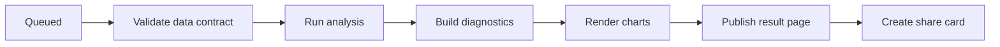
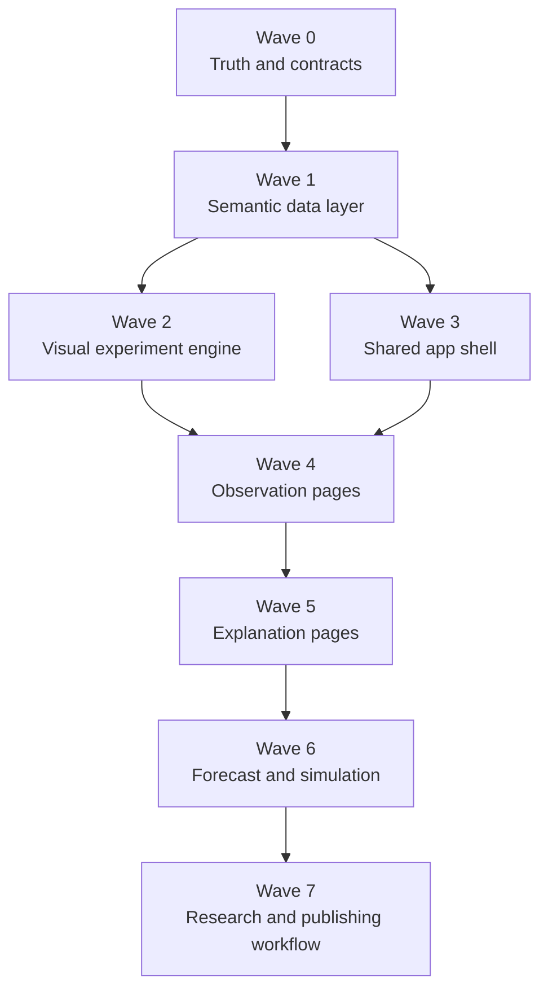

# Personal Complexity Lab Rebuild Plan

Implementation status updated: **2026-06-13**

The reference-data foundation described in Wave 0 is now implemented: the
machine-readable availability catalog covers 15 canonical datasets; official RBI
constant-price income, GSDP, road length, and personal loans are preserved with
converters; annual population denominators are explicitly estimated for 2012-2026;
infrastructure snapshots carry dates and reconciliation coverage; tax and policy
tables are normalized; unavailable dealer and vehicle-finance panels are blocked
from modelling; and the app includes a visual Reference Lab. Remaining work in
later waves is product and experiment workflow work, not permission to weaken these
truth boundaries.

## 1. Product Goal

Turn the current collection of analytical demonstrations into a personal research
cockpit for India's passenger-vehicle market. The rebuilt app should make it easy
to answer four recurring questions from actual Vahan and wholesale figures:

1. What changed in the market?
2. Where and for whom did it change?
3. Is the change structural, policy-driven, seasonal, or a data artifact?
4. What is likely to happen next under explicit assumptions?

The app should always distinguish:

- **Observed**: direct Vahan registrations or wholesale dispatches.
- **Derived**: shares, growth, concentration, channel ratios, model classifications.
- **Estimated**: regressions, changepoints, regimes, diffusion parameters, forecasts.
- **Simulated**: counterfactual and shock scenarios.

This distinction should appear in page labels, chart subtitles, downloads, and
saved research notes.

## 2. Audited Baseline

Repository health:

- 10 Streamlit pages and 13 published Quarto experiments.
- 84 tests pass; Ruff reports no issues.
- DuckDB contains 205,779 registration fact rows and 727,040 wholesale fact rows.
- Existing modules already cover descriptive analysis, econometrics, forecasting,
  network analysis, diffusion, regimes, tipping points, and shock simulation.

Current data:

- Vahan: January 2012 through April 2026.
- Vahan aggregate volume: 90.4 million registrations across all pre-aggregated and
  state rows. The All India series must not be reconstructed by summing states.
- Latest complete Vahan calendar year: 2025, with 4.42 million All India
  registrations, 4.01% EV share, 21.40% CNG share, and OEM HHI of 2,224.
- Wholesale: April 2017 through April 2026, 18.63 million units.
- Comparable full-industry wholesale era: April 2022 onward, 17.61 million units
  across 49 joined wholesale-retail months.
- Wholesale mapping gaps: 3.67% of volume lacks a state after expanding the
  crosswalk to 282 city labels. Wholesale has no fuel cut;
  external model metadata is available for most volume but cannot split mixed-fuel
  nameplates.
- The wholesale/retail ratio averages 1.073 in the comparable period.

Important audit findings:

- The database metadata says `partial_cal_years = []`, although 2026 contains only
  four months. Pages compensate with `max(year) - 1`, which works today but is not
  a reliable completeness contract.
- The shared state dimension includes Telangana for wholesale/reference data, but
  the current Vahan bundle does not contain a Telangana series. AP/TS cannot be
  joined at state level without a reconciliation dataset.
- Several Wholesale page queries use `year >= 2022`, which includes the
  January-March 2022 sample period despite calling the result the full era.
- Reference quality, source, snapshot, and coverage fields now survive into
  `panel_state_year` for joined covariates.
- `regs_per_1000_capita` now uses an explicitly estimated annual population
  denominator. The fixed-2024 version remains separately named for sensitivity.
  Infrastructure variables remain sparse dated snapshots, not historical panels.
- The Home page still contains a cache-warming placeholder and describes only
  four of the nine pages.
- Most pages are method-first. They expose an analysis technique but do not retain
  a shared market context, saved question, comparison set, or research trail.

## 3. Product Principles

### 3.1 Actual figures first

Every page starts with the observed market fact before showing a model. Forecasts
and simulations should always retain the observed history and a clear cutoff line.

### 3.2 One context across the lab

Create persistent global filters:

- Period and frequency: month, quarter, calendar year, financial year.
- Geography: All India, zone, state, saved state group.
- OEM and model.
- Fuel and segment.
- Source: Vahan, wholesale, or joined.
- Coverage policy: comparable full coverage, panel cities, or all available.

Store filters in `st.session_state` and query parameters so links are reproducible.

### 3.3 Progressive disclosure

Each page follows this order:

1. One-sentence finding.
2. KPI strip with comparison period.
3. Primary visual.
4. Drivers and decomposition.
5. Method diagnostics.
6. Data and methodology drawer.

The current experiment cards remain useful, but should move below the primary
answer rather than appearing before it.

### 3.4 Personal research memory

Add local-only research features:

- Save a view with filters and chart state.
- Pin states, OEMs, models, and hypotheses.
- Add a dated note to a chart or event.
- Save forecast/scenario runs with parameters.
- Export a research brief containing figures, data cutoff, assumptions, and links.

A small local SQLite or DuckDB schema is sufficient; no account system is needed.

## 4. Target Information Architecture

Use five navigation groups:

### Observe

- Home / Market Brief
- Market Pulse
- Explorer
- State Intelligence
- OEM and Model Intelligence
- Wholesale and Channel

### Explain

- Network Lab
- Diffusion Lab
- Transitions and Regimes
- Causal Lab

### Anticipate

- Forecast Studio
- Scenario and Shock Lab

### Research

- Saved Questions
- Experiment Notebook

### System

- Data Health and Refresh
- Method and Data Dictionary

The published Quarto site remains the immutable research record. The Streamlit app
becomes the interactive workbench that can promote a saved analysis into a new
experiment.

## 5. Page-by-Page Plan

## Home -> Market Brief

Current issue: it is a small landing page with one annual line chart, stale page
copy, and no wholesale or personal research context.

Rebuild:

- Show data cutoff badges: Vahan through April 2026; wholesale through April 2026;
  latest complete year 2025.
- Lead with a generated five-line brief: market size, growth, fuel shifts, OEM
  share movement, and channel condition.
- Add six KPI cards: latest complete month, rolling-12-month registrations, EV
  share, CNG share, leading OEM, wholesale/retail ratio.
- Add "largest moves" tables for states, OEMs, fuels, and models.
- Add recent policy/data events and clearly label the 2024 hybrid classification
  break.
- Add pinned watchlist and recently saved research views.
- Replace the static page list with task entry points such as "compare states",
  "inspect an OEM", "test a driver", and "build a forecast".

Acceptance criteria:

- No hard-coded latest year.
- Every metric names its period, source, and comparison.
- The page remains useful when wholesale data is absent.

## Macro Dashboard -> Market Pulse

Current strengths: good KPI strip, policy overlays, OEM share shifts, state fuel
maps, and channel ratio.

Rebuild:

- Add month, rolling quarter, YTD, rolling 12 months, calendar year, and FY modes.
- Use decomposition cards: volume change = base effect + fuel mix + geography +
  OEM share movement.
- Add seasonally adjusted growth and separate the festive/fiscal effects.
- Replace the crowded fuel area chart with selectable absolute/share views and an
  "other/unclassified" reconciliation line.
- Add contribution-to-growth waterfalls by state, OEM, and fuel.
- Add a dedicated completeness banner for recent Vahan months.
- Show channel health as inventory build/depletion episodes, not only a ratio line.
- Allow every visual to drill into State, OEM, or Wholesale pages with filters
  preserved.

Acceptance criteria:

- National totals reconcile to the All India source row.
- Latest-period comparisons use like-for-like month counts.
- Partial months and data breaks are visible in the plotting area.

## Explorer -> Compare and Explore

Current issue: useful map plus time series, but a single selected metric does not
support structured comparison or explanation.

Rebuild:

- Add side-by-side and indexed comparison modes for states and OEMs.
- Add rank, rank change, percentile, CAGR, volatility, and contribution metrics.
- Add scatter/bubble view with configurable axes and size.
- Add table view with conditional formatting and CSV export.
- Add state grouping by zone, income quartile, urbanization quartile, and saved
  cohorts.
- Let map clicks add a state to the comparison set.
- Add normalization options: total units, share, per 1,000 population, and index
  to 100.
- Show reference quality badges in tooltips.

Acceptance criteria:

- A saved URL reproduces the selected metric, period, normalization, and entities.
- Users can compare at least six entities without unreadable labels.

## Networks -> Network Lab

Current issue: the spring-layout bipartite graph is visually unstable and difficult
to use for year-to-year reasoning.

Rebuild:

- Default to a matrix/heatmap of state by OEM share; retain the node-link graph as
  an optional structural view.
- Use a fixed layout across years and animate only edge strength.
- Add three network modes: OEM-state, state similarity, and inferred EV adoption.
- Add ego-network mode for one OEM or state.
- Explain changes through centrality, community movement, edge births/deaths, and
  robustness to threshold.
- Add a "compare two periods" view around BS6, COVID, FAME, and user-selected
  events.
- Add null-model diagnostics and uncertainty beside inferred networks.
- Link selected nodes to their State or OEM profile.

Acceptance criteria:

- Node positions do not jump when the year changes.
- Threshold sensitivity is shown, not hidden behind one slider value.
- Inferred and observed edges are visually distinct.

## Diffusion Lab

Current strengths: user-controlled fit window, sensitivity scan, explicit bound
warning, and cross-state parameters.

Rebuild:

- Start with adoption share and annual/monthly flow, then offer cumulative units.
- Separate "fit historical curve" from "policy scenario"; do not combine them in
  one control block.
- Add model comparison: Bass, logistic, Gompertz, and naive trend, ranked by
  rolling or held-out error.
- Add parameter uncertainty/bootstrap intervals and a fit-quality grade.
- Add covariate comparison for state parameters: income, urbanization, chargers,
  fuel price, and policy timing, with quality flags.
- Add milestone probabilities/dates such as 5%, 10%, and 20% share.
- Exclude Strong Hybrid Vahan fits across the 2024 classification break.
- Save scenario assumptions and compare scenarios side by side.

Acceptance criteria:

- No projection is shown without an out-of-sample or sensitivity diagnostic.
- A parameter at the optimization bound cannot be presented as a trusted KPI.

## Hypothesis Tester -> Causal Lab

Current issue: correlation, LSDV regression, and fixed-number changepoints are easy
to run but too easy to over-interpret.

Rebuild:

- Begin with a structured hypothesis: outcome, driver, unit, expected sign, period,
  lag, and identification strategy.
- Add a data-availability preview before running a model.
- Separate descriptive correlation from causal/econometric methods.
- Add coefficient plots, confidence intervals, effect sizes in practical units,
  within/between variation, and residual diagnostics.
- Add two-way fixed effects by default where appropriate.
- Add lagged drivers, first differences, Granger tests, event studies, DiD with
  placebo distribution, and automatic changepoint penalties.
- Block or warn on near-time-invariant covariates under state fixed effects.
- Surface source quality and missingness for every selected regressor.
- Save the hypothesis and result as a research card.

Acceptance criteria:

- The output states what variation identifies each coefficient.
- No p-value is shown without effect size, interval, sample size, and model caveats.

## Wholesale -> Wholesale and Channel

Current issue: this is the most commercially useful data, but it is split into
simple tabs and some queries mix the sample and full-coverage periods.

Rebuild:

- Enforce a central coverage policy:
  - National/state totals use `date >= '2022-04-01'`.
  - Long history uses a named panel-city cohort.
  - Never silently mix the two.
- Add channel cockpit: wholesale, retail, gap, ratio, rolling stock-build estimate,
  and episode annotations.
- Add OEM-state-month joined views to compare dispatch and registration share,
  response lag, and forecastability.
- Add OEM/model portfolio treemap, launch/ramp curves, lifecycle peak detection,
  and model contribution to growth.
- Add segment transition view with hatchback/SUV grouping, OEM mover class, city
  tipping threshold, and state archetypes.
- Add city map and unmapped-volume warning.
- Remove any presentation implying a wholesale fuel mix or fuel cut.
- Where useful, show model-metadata tiers only: EV-only nameplates, mixed-fuel
  nameplates with unknown powertrain quantities, and unclassified models.
- Add a nowcast production panel with model coefficients, rolling errors, baseline,
  current nowcast, and vintage tracking as Vahan fills in.

Acceptance criteria:

- Every wholesale chart displays its coverage regime.
- No wholesale chart reports fuel volume, fuel share, or fuel mix.
- January-March 2022 sample rows never enter full-industry charts.
- The current unmapped state volume is shown wherever state results are used.

## Phase Transitions -> Transitions and Regimes

Current issue: four distinct research questions are placed in one dense tab set.

Rebuild:

- Use a landing selector for four analyses: network percolation, adoption tipping,
  rule-based fuel regimes, and HMM regimes.
- Add a plain-language verdict card: gradual, accelerating, saturating, or
  inconclusive.
- Plot calendar dates, not row indexes, for inspected tipping series.
- Add uncertainty/stability across smoothing windows, thresholds, and sample ends.
- Compare rule-based and HMM regime assignments and highlight disagreements.
- Add state transition profiles with entry date, persistence, reversal, and peer
  states.
- Add early-warning indicators from `complexity.dynamics`.
- Link each transition to candidate policy/data events without claiming causality.

Acceptance criteria:

- Thresholds include a stability measure.
- The app can say "no credible transition" rather than forcing a classification.

## Forecast Studio

Current strengths: rolling-origin selection and a visible champion model.

Rebuild:

- Support national, state, OEM, and Vahan-fuel forecasts; wholesale forecasts remain
  model/OEM/segment/geography based because wholesale has no fuel cut.
- Add direct comparison of model errors by horizon and origin.
- Report MAPE, WAPE, MAE, bias, interval coverage, and naive-relative skill.
- Add forecast vintages and actual-versus-forecast tracking.
- Add optional exogenous features: wholesale, fuel prices, policy events, festive
  calendar, and recent share trend, only when their historical coverage supports
  the selected period.
- Add hierarchical reconciliation so national, state, OEM, and fuel totals agree.
- Use completeness-aware training cutoffs instead of always dropping exactly two
  months.
- Add scenario bands separately from the statistical forecast.
- Save and export a forecast card with model, training cutoff, backtest score, and
  assumptions.

Acceptance criteria:

- The winning model must beat or explicitly fail to beat a naive benchmark.
- Prediction intervals are non-negative and have measured historical coverage.
- Aggregated forecasts reconcile across hierarchy.

## Shock Lab -> Scenario and Shock Lab

Current issue: a useful generic stock-flow simulator is not calibrated to current
Vahan/wholesale levels and presets require manual slider entry.

Rebuild:

- Add one-click COVID, chip shortage, BS6, festive overbuild, and demand-boom
  presets.
- Calibrate baseline demand, wholesale, and channel ratio from a selected observed
  period.
- Show historical episode overlays beside the simulated signature.
- Separate demand, supply, pricing, policy, and infrastructure levers.
- Add Monte Carlo ranges around uncertain shock duration and magnitude.
- Add scenario comparison table with lost sales, inventory peak, recovery time,
  bullwhip, and cumulative registrations.
- Add state/OEM segmentation after the national model is validated.
- Clearly label this page simulated and prevent scenario lines from looking like
  forecasts.

Acceptance criteria:

- Every scenario records its calibration period and parameter set.
- Historical presets reproduce directionally correct observed signatures before
  the simulator is used for forward counterfactuals.

## 6. New Pages

## State Intelligence

One page per state with market size, fuel transition, OEM leaderboard, peer group,
income/urbanization/infrastructure context, policy timeline, wholesale segment mix,
regime history, and forecast. Include a special AP/Telangana caveat.

## OEM and Model Intelligence

One page per OEM with retail share, wholesale share, channel gap, state strength,
Vahan fuel mix, wholesale segment/model portfolio, launch curves, concentration,
network position, and forecastability. Wholesale does not supply a fuel cut.

## Saved Questions

Local research inbox containing saved views, hypotheses, annotations, forecasts,
and scenarios. Each item stores filters, data cutoff, method version, notes, and
an exportable research-card layout.

## Data Health and Refresh

Show source freshness, row counts, current coverage, partial periods, validation
checks, wholesale mapping coverage, reference quality, and refresh commands. This
page should become the single authority for what periods are safe to compare.

It should render the rules and verification results from
[`DATA_TRUTH.md`](../DATA_TRUTH.md), including:

- Vahan month completeness derived from facts.
- Telangana/AP join restrictions.
- Wholesale sample/full coverage and city-mapping coverage.
- Explicit confirmation that wholesale has no fuel cut; model metadata coverage is
  reported separately and never presented as fuel volume/share.
- Reference-series time coverage and quality.
- Input hashes, validation status, and detected schema/category changes.

## 7. Data and Engineering Foundation

### 7.1 Completeness contract

Create a `data_period_status` table or view with:

- source
- grain
- period
- observed month count
- expected month count
- completeness status
- freshness date
- coverage regime
- warning text

Derive latest complete month/year from facts and metadata. Stop using
`max(year) - 1` throughout the app.

### 7.2 Semantic views

Add tested views/functions for:

- National Vahan monthly and annual facts.
- Comparable wholesale full-era facts.
- Wholesale panel-city history.
- OEM-state-month wholesale-retail join with AP/TS blocked by default.
- OEM/model/segment contribution to growth.
- Data quality and mapping coverage.
- Reference value plus source and quality.
- EV-only, mixed-fuel, and unclassified model-metadata tiers, explicitly separate
  from observed wholesale measures.
- Annual population denominators or an explicitly named fixed-2024 denominator.

Pages should call parameterized data-access functions, not construct raw f-string
SQL. This also removes the current quoting risk and centralizes coverage rules.

### 7.3 Global state and page shell

Build shared components for:

- Global filters.
- Page header and finding card.
- Data cutoff/coverage badge.
- KPI cards.
- observed/derived/estimated/simulated label.
- policy event overlays.
- chart download and permalink.
- methodology and provenance drawer.
- empty/missing-data states.

### 7.4 Personal persistence

Add local tables:

- `saved_view`
- `watchlist_item`
- `research_note`
- `hypothesis_run`
- `forecast_run`
- `scenario_run`

Store a JSON parameter payload, data cutoff, package version or Git commit, created
time, title, and notes.

### 7.5 Testing

Keep the current unit tests and add:

- Data-contract tests for completeness and coverage.
- Query tests ensuring sample/full wholesale periods never mix.
- Reconciliation tests for page KPIs.
- Streamlit page smoke tests.
- Golden tests for saved filter serialization.
- Forecast leakage and interval-coverage tests.
- Visual regression checks for the main page shell and maps.
- City-map drift tests and largest-unmapped-city reports.
- AP/TS join prohibition tests.
- Experiment artifact and privacy-policy tests.

### 7.6 Visual Experiment Publishing System

The experiment system should become a visible part of the product, not only a CLI
that writes parquet files.

Every run should have this lifecycle:



Standard run directory:

```text
outputs/<experiment>/<run-id>/
  manifest.json
  result.md
  hero.html
  hero.png
  share-card.png
  figures/
    01-primary.html
    01-primary.png
    02-diagnostic.html
    02-diagnostic.png
  tables/
    ...
  data/
    ...
  run.log
```

The manifest must add:

- run status and stage timestamps
- input file hashes
- data cutoffs and coverage policy
- Git commit and package versions
- parameters and random seeds
- primary finding and limitations
- figure and table metadata
- public/private artifact classification

App experience:

- **Experiment Gallery**: visual cards for every experiment, showing a hero image,
  one finding, data cutoff, and latest run status.
- **Run Experiment**: parameter controls, expected inputs, and a visible execution
  timeline.
- **Live Run View**: current stage, elapsed time, logs, partial metrics, and figures
  appearing as they are completed.
- **Result View**: narrative, interactive charts, diagnostics, assumptions,
  limitations, downloadable data, and links to related runs.
- **Compare Runs**: parameter and data-vintage differences with overlaid figures.
- **Share View**: stable result URL plus generated image card for social posts,
  presentations, and messages.

Visual requirements:

- Every experiment gets one editorial hero chart and at least one robustness or
  diagnostic chart.
- Network experiments include a fixed-layout interactive network and a simpler
  matrix/summary image for sharing.
- Time experiments include policy/data-break annotations and observed-versus-model
  styling.
- Transition experiments include calendars or small-multiple trajectories.
- Forecasts include historical backtests, error distribution, and future interval.
- Simulations include baseline/scenario comparison and an assumption panel.
- Selected temporal experiments may export short MP4/GIF animations, but static PNG
  and interactive HTML remain mandatory.

Privacy rule:

- Proprietary wholesale rows, city-level raw tables, and model-city extracts remain
  local.
- Public result pages may contain approved aggregates and charts only.
- The publishing step must fail closed when an artifact has no public/private
  classification.

## 8. AI Execution Sequence

This is a dependency graph, not a human staffing estimate. AI performs implementation,
tests, documentation, migrations, chart generation, and browser verification. Human
input is reserved for proprietary-data publication approval and genuinely ambiguous
business definitions.



## Wave 0: Truth and Contracts

- Turn `DATA_TRUTH.md` rules into executable checks.
- Use the promoted RBI constant-price income (Table 20) for real-income questions;
  keep current-price income for nominal context.
- Keep promoted RBI road length and personal loans as explicitly constrained
  contextual series. Personal loans are credit depth, not auto-finance penetration.
- Replace the current estimated annual state population with an archived official
  state-year projection series when a reproducible source file is acquired.
- Build dated official EV-charger and CNG-station snapshots before treating either
  as a dynamic panel.
- Implement calculated period completeness and freshness.
- Correct all wholesale full-era filters.
- Block AP/TS state-level cross-source joins.
- Add city-map and model-fuel-map coverage reports.
- Preserve reference source/quality metadata.
- Preserve both the annual-estimate metric and explicitly named fixed-2024
  sensitivity metric.
- Add regression tests for every audited issue.

Terminal condition: one automated truth command passes and produces a machine-readable
data-health report.

## Wave 1: Semantic Data Layer

- Create parameterized data-access functions and semantic views.
- Centralize time, geography, coverage, OEM, fuel, model, and segment filters.
- Add exact/mapped/derived/estimated/simulated metadata to result objects.
- Add wholesale full-era and panel-city cohorts as explicit query modes.
- Add versioned data snapshots and input hashes.

Terminal condition: no app page needs raw SQL to enforce coverage or join rules.

## Wave 2: Visual Experiment Engine

- Extend the runner lifecycle and manifest.
- Build chart-rendering helpers and the standard artifact directory.
- Backfill hero and diagnostic visuals for all 13 current experiments.
- Build Experiment Gallery, Live Run View, Result View, and Compare Runs.
- Generate static share cards and interactive result pages.
- Add public/private artifact classification.

Terminal condition: every registered experiment can run end to end and produce a
visually complete, shareable result bundle.

## Wave 3: Shared App Foundation

- Implement global filters and URL state.
- Build the shared page shell, badges, KPI, finding, export, provenance, and
  methodology components.
- Add the Data Health page backed by executable truth checks.
- Add local saved-view and watchlist persistence.

Terminal condition: a filter chosen on Home survives navigation, can be shared, and
retains its data-truth context.

## Wave 4: Observation Pages

- Rebuild Home, Market Pulse, Explorer, and Wholesale.
- Add State Intelligence and OEM/Model Intelligence.
- Add drill-through links, watchlists, chart exports, and share views.
- Verify each page in the running app with visual browser checks.

Terminal condition: any major movement can be traced through geography, OEM, fuel,
segment, model, and channel layers without violating a truth rule.

## Wave 5: Explanation Pages

- Rebuild Networks, Diffusion, Causal Lab, and Transitions.
- Add diagnostics, uncertainty, nulls/placebos, and saved research cards.
- Connect each page to runnable, visual experiments.

Terminal condition: every analytical claim includes identifying data, robustness,
and a visible "do not infer" boundary.

## Wave 6: Forecast and Simulation

- Rebuild Forecast Studio and Scenario/Shock Lab.
- Add wholesale-driven forecasts, vintages, calibration, and scenario comparison.
- Add reconciliation, interval validation, and visual run comparison.

Terminal condition: forecasts and simulations are reproducible, evaluated, visually
distinct, and shareable without being mistaken for observations.

## Wave 7: Research and Publishing Workflow

- Build Saved Questions and research notes.
- Export visual research briefs.
- Add "promote to experiment" scaffolding for Quarto notebooks.
- Publish approved aggregate experiment result pages to the notebook site.
- Update the refresh runbook and all documentation.

Terminal condition: an exploratory app session can become a dated, reproducible,
visual research artifact without manually reconstructing filters or assumptions.

## 9. Priority Backlog

P0:

- Period completeness contract.
- Annual state population acquisition.
- Wholesale coverage correction.
- AP/TS join protection.
- Population denominator correction.
- Executable data-truth audit.
- Visual experiment runner and standard result bundle.
- Data Health page.
- Global filters and URL state.
- Home, Market Pulse, and Wholesale rebuild.
- State and OEM profile pages.

P1:

- Road-infrastructure and broad credit-depth reference experiments with boundary
  and interpretation guards.
- Saved views and research notes.
- Experiment Gallery, live run view, and run comparison.
- Hero/diagnostic charts for all existing experiments.
- Share-card generation with proprietary-data guardrails.
- Causal Lab safeguards.
- Forecast vintages and wholesale features.
- Network fixed-layout and comparison mode.
- Transition stability diagnostics.

P2:

- Hierarchical forecast reconciliation.
- Monte Carlo shock ranges.
- Research brief export.
- App-to-Quarto experiment scaffolding.
- Better city mapping and model fuel classification.
- Optional animated experiment exports.

## 10. Success Measures

The rebuild is successful when:

- A market question can be answered in three clicks or fewer from Home.
- Every displayed number has source, cutoff, coverage, and comparison context.
- No page silently mixes wholesale coverage regimes.
- No AP/TS result implies a Vahan state comparison that the source cannot support.
- A saved analysis can be reproduced from its URL or research card.
- Observed, estimated, forecast, and simulated values are never visually ambiguous.
- State, OEM, model, fuel, segment, and channel views connect through drill-downs.
- Every model page exposes diagnostics and can return an inconclusive result.
- Every experiment run produces a hero visual, diagnostics, a result page, and a
  privacy-classified share asset.
- Running experiments expose visible stage progress and retain complete logs.
- The app remains fast enough for interactive use: under 2 seconds for cached page
  loads and under 10 seconds for deliberately expensive model runs.
